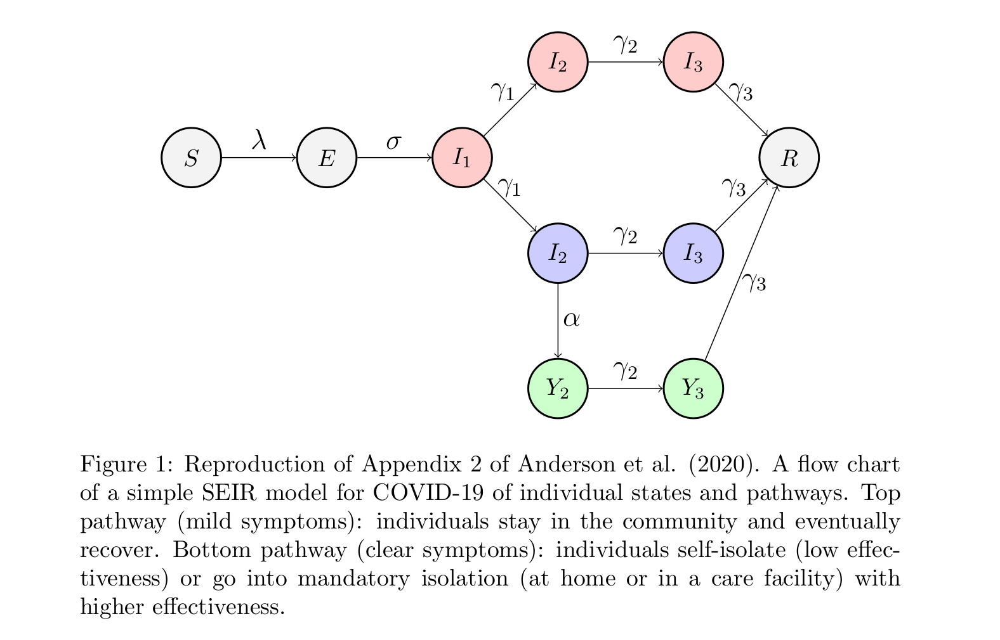

# COVID19 SEIR model

Model of COVID-19 transmission from Sir Roy Anderson's 2020 publication in The Lancet

- :page_facing_up: Anderson _et al._ (9th March, 2020) [How will country-based mitigation measures influence the course of the COVID-19 epidemic?](https://doi.org/10.1016/S0140-6736(20)30567-5)
  - Appendix 1: ["Features of COVID-19 infection that affect how mitigation measures will influence the shape of the epidemic curve"](https://www.thelancet.com/cms/10.1016/S0140-6736(20)30567-5/attachment/7d119bf0-a2fd-49f8-b347-7d685f38a773/mmc1.pdf)
  - Appendix 2: ["A flow chart of a simple epidemic model for COVID-19 of individual states and pathways with rates of transferbased on appendix 1"](https://www.thelancet.com/cms/10.1016/S0140-6736(20)30567-5/attachment/56ee104d-c810-4fdf-ba0a-e4497ad1034d/mmc2.pdf)
  - Appendix 3: ["Key drivers of the effective reproductive number R during mitigationfor the model in appendix 2"](https://www.thelancet.com/cms/10.1016/S0140-6736(20)30567-5/attachment/5296c337-9e61-46e4-89d2-8c91fb1fd1aa/mmc3.pdf)

This is a [SEIR model](https://en.wikipedia.org/wiki/Compartmental_models_in_epidemiology#The_SEIR_model):
- S: susceptible
- E: exposed
- I: infectious
- R: recovered

Here is a reproduction of the figure in appendix 2 (source: [tex](doc/seir_diagram.tex)/[pdf](doc/seir_diagram.pdf)):

